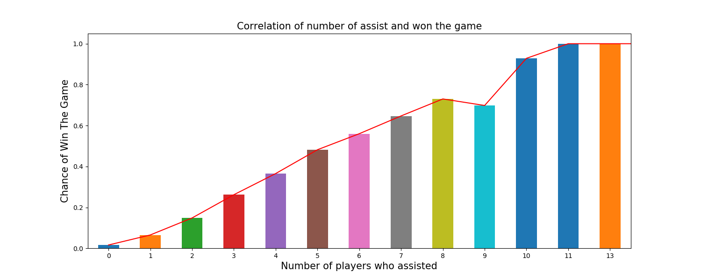
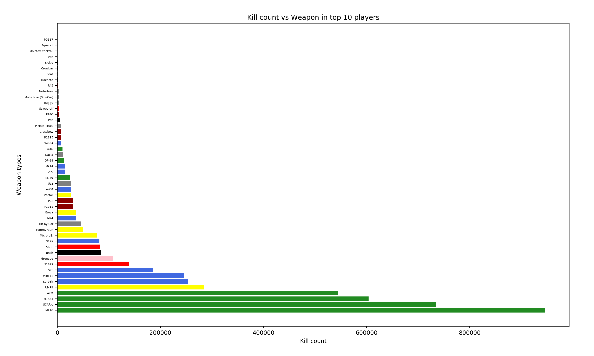
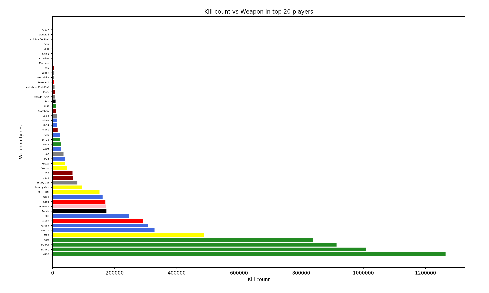

# Data-mining-project
A PUBG [(wiki page)](https://en.wikipedia.org/wiki/PlayerUnknown%27s_Battlegrounds) game data mining project that focus on giving player intuition of how to survive longer and have a better chance to win the game.

## Dataset
Download the dataset from Kaggle to current directory at: [PUBG Match Deaths and Statistics](https://www.kaggle.com/skihikingkevin/pubg-match-deaths/data).

## Contribution

### 1. Go offensive or deffensive
This contribution is discussing about whether actively attaching or hiding would lead to a winning situation.

```
# Running the code in terminal by typing:
python offensive_vs_deffensive.py
```

  
This code group the factor of "player_kills" and "won" the game together to see the correlation between how many people the player killed and won the game.
```
agg0.loc[agg0['player_kills'] < 45, ['player_kills', 'won']].groupby('player_kills')
```

### 2. Go solo or collaborate
This contribution discusses about whether go solo or collaborate in the group game mode would lead to a winning situation.

```
# Running the code in terminal by typing:
python solo_vs_collaborate.py
```

 This code group the factor of "play assists" and "won" the game together with party size greater than 1 which is group game mode
```
agg0.loc[agg0['party_size'] != 1, ['player_assists', 'won']].groupby('player_assists')
```

### 3. Best weapon to use
  Mining the weapons choosed by top 20 players in each game, which contributes the decision making on weapon choice. The color of the bar in the chart shows the attack range of the weapon, where the hotter colors represent the shorter range, the colder colors represent the longer range.
  <br />
  The pre-processing cleans up all death caused by accident. Then, collect valid records.
  
  ```
  # Please place the file 'kill_match_stats_final_0.csv' at the same folder as best_weapon.py
  # Running the code in terminal by typing:
  python3 best_weapon.py
  ```
  
  
  
### 4. Final circle analysis
  We mine the final locations of the winner (1st player) in each game. This reflects the locations of the final circle.
  Since the final circle (final safety area) is not randomly generated by the system. It tends to be generated in the area with the least survivors. Therefore, this mining reflects the players' behavior pattern. It answers the questions: "which area players less possible to hide?" and "which area is the most safety for us to go?"
  
  ```
  # Please place the file 'kill_match_stats_final_0.csv' at the same folder as best_weapon.py
  # Running the code in terminal by typing:
  python3 final_circle_analysis.py ERANGEL
  or
  python3 final_circle_analysis.py MIRAMAR
  where ERANGEL and MIRAMAR are two maps in the game.
  ```
   
   
   
### 5. Weapon choice sequential mining
  We mine the weapons sequence of the winner (1st player) in each game. This helps the the decision making on weapon choice that related to the game timing. 
 
 ```
  # Please place the file 'kill_match_stats_final_0.csv' at the same folder as weapon_sequential_mining.py
  # Running the code in terminal by typing:
  python3 final_circle_analysis.py 3
  where the argument 3 is the minimum support. 
  ```
  
